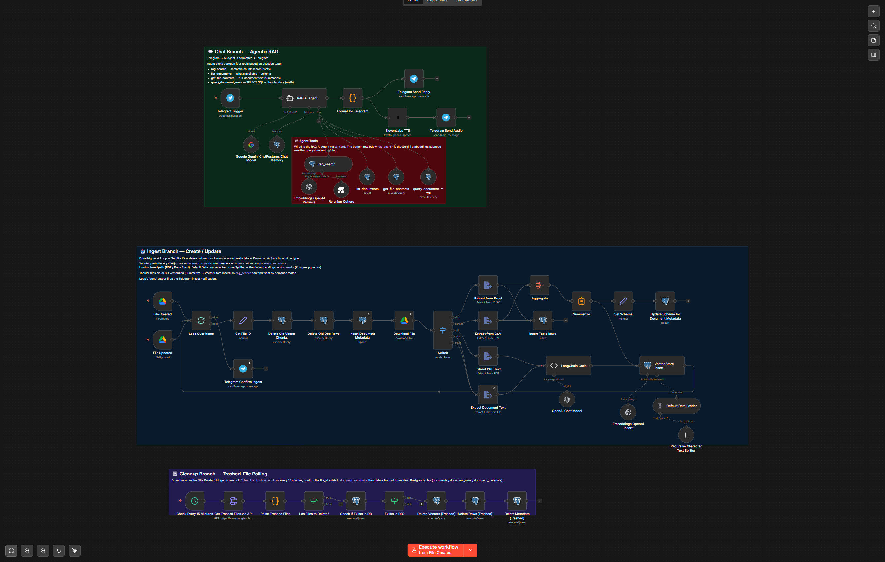
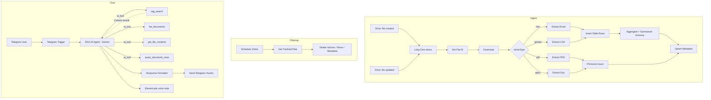
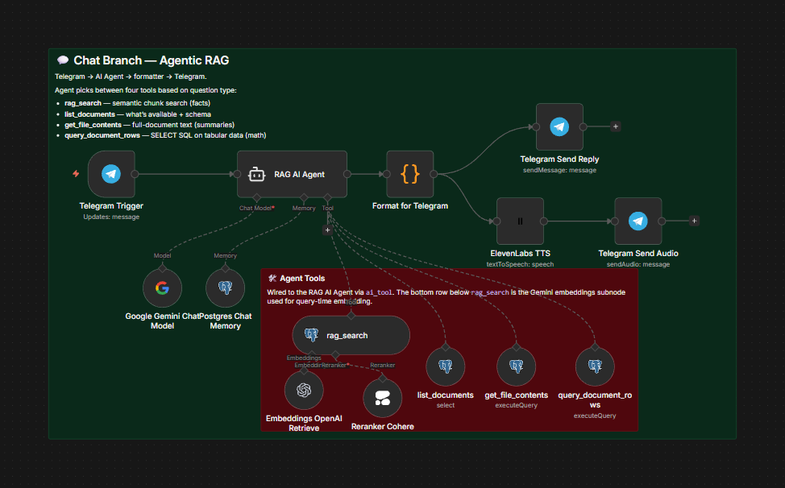
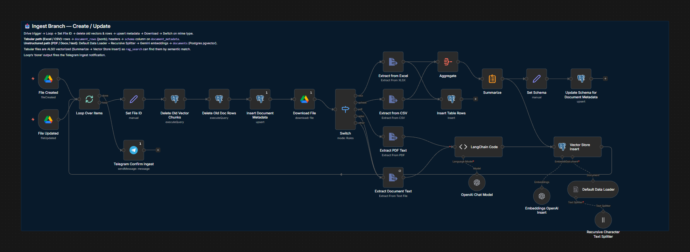
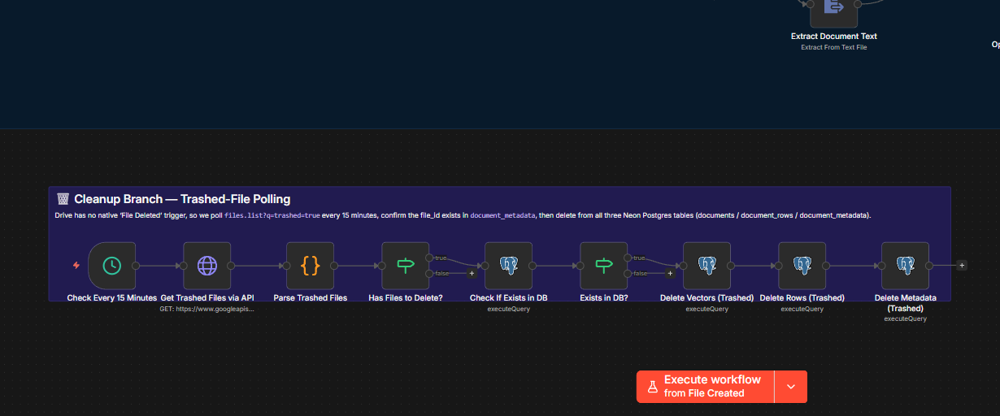

# Agentic RAG Agent

> Drop a file in a watched Google Drive folder. Ask Telegram a question about it. The agent picks the right retrieval tool — semantic search, full-document fetch, or a SQL query against your tabular data — and answers, with citations.



## What it does

- Watches a **Google Drive folder** for new and updated files (PDF, Google Doc, Google Sheet, XLSX, plain text).
- For prose files: chunks → embeds with **OpenAI `text-embedding-3-small` (1536 dims)** → stores in **Neon Postgres / pgvector**.
- For tabular files (XLSX / Google Sheets): each sheet becomes its own dataset, rows stored as JSONB in `document_rows`, schema cached for the SQL tool.
- Cleans up vectors and metadata when files are trashed in Drive (15-min schedule sweep).
- Serves a **Gemini-backed agent** over Telegram with **four tools**:
  1. `rag_search` — semantic search over chunked prose
  2. `list_documents` — what's been ingested
  3. `get_file_contents` — fetch all chunks of one file
  4. `query_document_rows` — run SQL against the JSONB rows table
- Answers in Telegram with **chunked output** for long replies and **ElevenLabs voice notes** when asked.

## Architecture



Inspired by Cole Medin's Ultimate RAG AI Agent V4 template; adapted for **Gemini + Neon + Telegram** with persistent chat memory and tabular SQL support.

## Tech stack

- [n8n](https://n8n.io) (self-hosted)
- **Neon Postgres** with `pgvector` extension
- **OpenAI** embeddings (`text-embedding-3-small`, 1536 dims)
- **Cohere** reranker
- **Google Gemini** (chat model)
- **LangChain** semantic chunker + recursive character splitter
- **ElevenLabs** for optional voice replies
- Telegram Bot API
- Google Drive (input)

## Setup

### 1. Provision Neon

1. Create a Neon project. Note the connection string (you'll need both pooled and direct endpoints).
2. In Neon's SQL Editor, run the schema files **in order**:
   - [`sql/000_pgvector_and_documents.sql`](sql/000_pgvector_and_documents.sql) — pgvector + `documents` table
   - [`sql/001_document_metadata.sql`](sql/001_document_metadata.sql) — `document_metadata` + `updated_at` trigger
   - [`sql/002_document_rows.sql`](sql/002_document_rows.sql) — `document_rows` + indexes
   - [`sql/003_rag_readonly_role.sql`](sql/003_rag_readonly_role.sql) — read-only role grants
3. Create the `rag_readonly` Postgres role:
   ```sql
   create role rag_readonly login password '<pick-a-long-password>';
   ```
   Then re-run `003_rag_readonly_role.sql` so the grants land.

### 2. Self-host n8n

```bash
docker run -it --rm --name n8n -p 5678:5678 -v n8n_data:/home/node/.n8n n8nio/n8n
```

### 3. Create credentials in n8n

| Credential | Type | Notes |
|---|---|---|
| `Neon Postgres (write)` | Postgres | default Neon role, used by all ingest writes |
| `Neon Postgres (rag_readonly)` | Postgres | the `rag_readonly` role you created above; used by the 4 tool nodes |
| Telegram Bot | Telegram | bot token from BotFather |
| Google Drive OAuth2 | OAuth2 | for the file triggers |
| Google Gemini | API key | from [aistudio.google.com](https://aistudio.google.com) |
| OpenAI | API key | for embeddings only |
| Cohere | API key | for the reranker |
| ElevenLabs | API key | for voice replies |

### 4. Import the workflow

In n8n: Workflows → Import from File → [`workflow/rag-agent.n8n.json`](workflow/rag-agent.n8n.json).

### 5. Wire the workflow

- For each Postgres node, pick the right credential — **the 4 tool nodes get `Neon Postgres (rag_readonly)`**, everything else gets `Neon Postgres (write)`. The placeholder ids in the JSON (`REPLACE_ME_POSTGRES_CREDENTIAL_ID`) make it obvious which need binding.
- Pick your Drive folder ID in both `File Created` and `File Updated` triggers (and the `Get Trashed Files via API` query).
- Replace your Telegram chat ID in any node still showing `REPLACE_ME_TELEGRAM_CHAT_ID` (alert routes).

### 6. Activate

Drop a test PDF in your watched folder. After a few seconds you should see ingestion logs. Then message your Telegram bot and ask about the file.

## Verify

```bash
python tools/verify_workflow.py workflow/rag-agent.n8n.json    # structural
python tools/verify_rag_workflow.py workflow/rag-agent.n8n.json # semantic (4 tools wired, switch branches, etc.)
```

## Environment variables

Optional — only for the helper scripts in `tools/`. Copy `.env.example` to `.env`.

| Variable | Purpose |
|---|---|
| `N8N_BASE_URL` | Your n8n instance URL |
| `N8N_API_KEY` | n8n personal API key |
| `N8N_RAG_WORKFLOW_ID` | Workflow ID once imported |

## Tools

- `tools/sync_workflow.py` — push local edits to running n8n.
- `tools/verify_workflow.py` — structural checks.
- `tools/verify_rag_workflow.py` — semantic checks (4 tools wired, 5 switch branches, both Drive triggers reach Loop Over Items, etc.).
- `tools/fetch_execution.py` — pull a single run's data (essential for debugging tool calls).
- `tools/list_executions.py` — recent runs.

## Screenshots

Per-branch detail views of the canvas:



*Chat branch: Telegram → RAG AI Agent (Gemini) wired to four tools (rag_search with Cohere reranker, list_documents, get_file_contents, query_document_rows) plus Postgres chat memory and ElevenLabs voice replies.*



*Ingest branch: Drive triggers (file created / updated) → loop → dedup deletes → mime switch → tabular path (rows + schema) and unstructured path (chunk + embed → pgvector).*



*Cleanup branch: schedule fires every 15 minutes, queries Drive for trashed files, deletes their vectors / rows / metadata from Neon.*

## See also

- [Workflow SOP](workflow/rag-agent.md) — full prose walkthrough including the chunking strategy, dedup logic, and trashed-file cleanup behavior.
- [WAT framework](docs/WAT-framework.md) — the **W**orkflows / **A**gents / **T**ools pattern.

## Credits

Built on [n8n](https://n8n.io). Topology adapted from Cole Medin's Ultimate RAG AI Agent V4 template. Companion repos:

- [ocr-invoice-agent](https://github.com/JKP143/ocr-invoice-agent)
- [video-analysis-agent](https://github.com/JKP143/video-analysis-agent)
- [legal-ai-agent](https://github.com/JKP143/legal-ai-agent)

## License

MIT — see [LICENSE](LICENSE).
